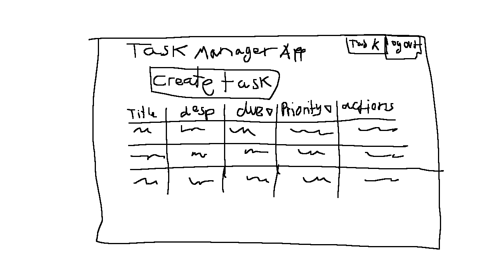
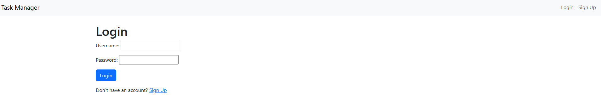
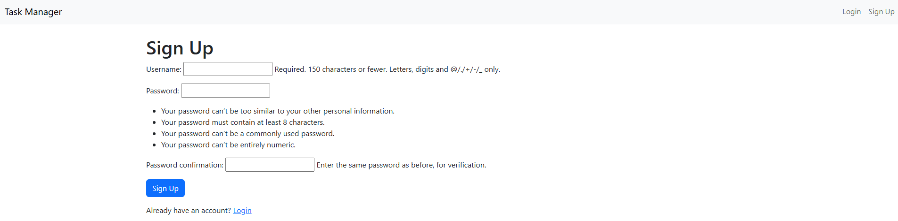
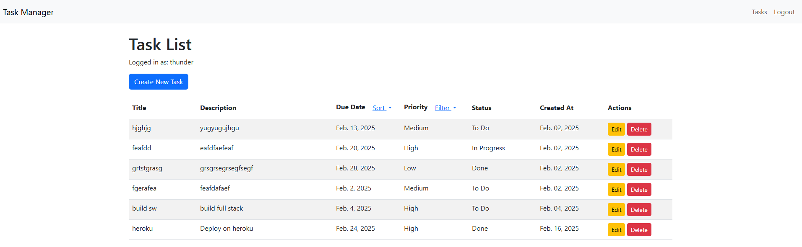
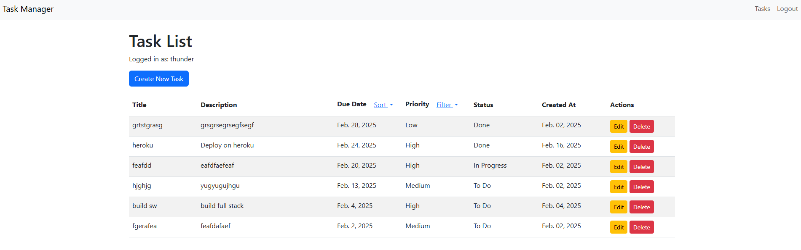
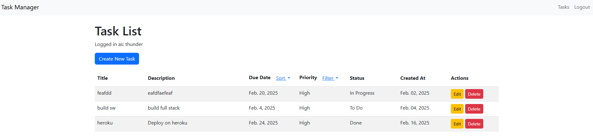
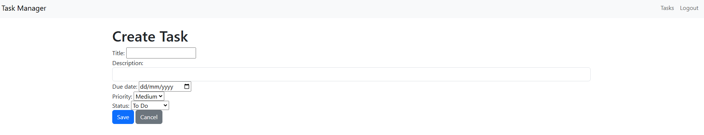
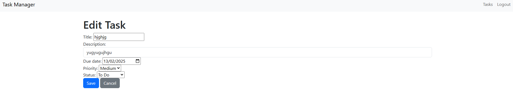
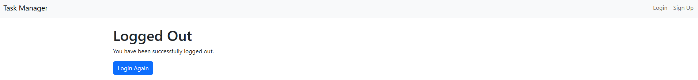
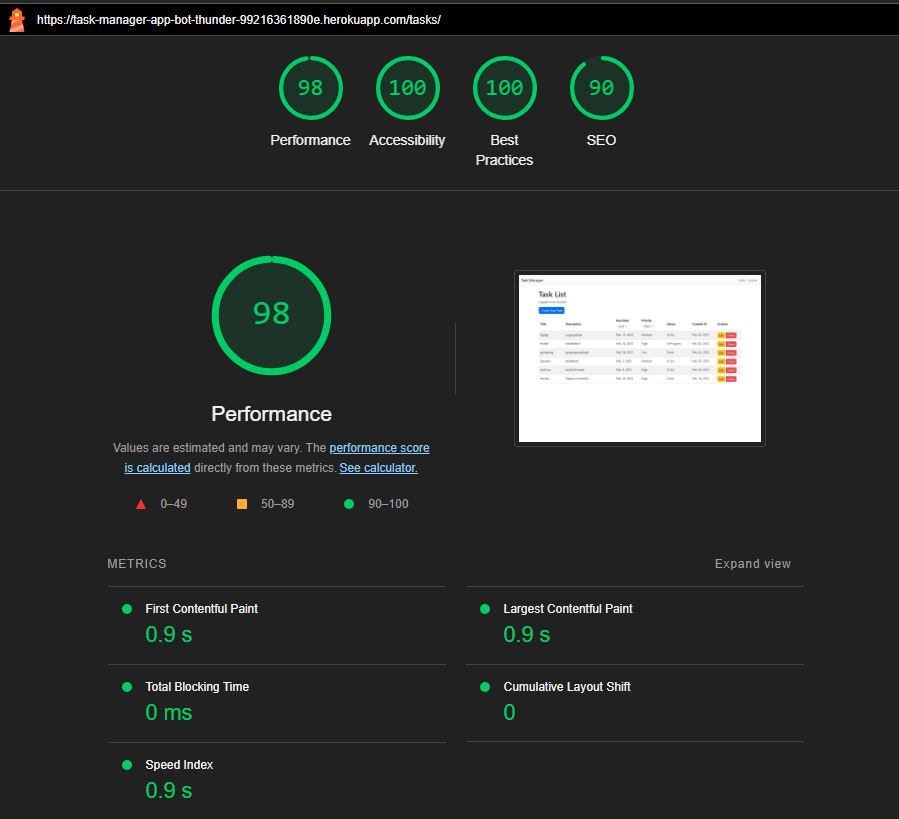

# Task Management App

## Talbe of Contents

- [Features](#features)
  - [Connecting Database](#connecting-the-database)
  - [Existing Features](#existing-features)
  - [Features Let to Implement](#features-left-to-implement)
- [Testing](#testing)
  - [Validator Testing](#validator-testing)
  - [User Stories](#user-stories)
- [Deployment](#deployment)
- [Credits](#credits)
  - [Content](#content)

The purpose of this project was to design an app that help individual users to manage their tasks effectively. The app will allow users to add, delete, and mark tasks as completed, add and delete categories for tasks, view all tasks and categories, view all tasks in a specific category, view all tasks that are not completed, view all tasks that are completed, view all tasks that are due today. This app is designed at people who struggle to manage daily tasks and want a clear structure to how they want to view their tasks.

Below is a wireframe of the concept of the app.



## Features

This project features a back-end framework which is Django, and a database which is PostgresSQL. The app was deployed on a hosting site called Heroku. The HTML, CSS and JavaScript were used to create the front-end of the app. The CSS and JavaScript were added using BootStrap. The initial plan was to use React to creat the front-end but that proved to be difficult and decided to get the app working and implement React in the future. The app was tested using Django's built-in testing framework.

### Connecting the database

The database was connected using django database url. The database was created using PostgresSQL. Two packages needed to be installed to connect the database which are dj_database_url and psycopg2-binary. For security purposes a env.py file was created to hide sensitive information. The database was connected to the app using the following code : 
``` 
import os
import dj_database_url
if os.path.isfile('env.py'):
    import env

DATABASES = {
    'default': dj_database_url.parse(os.environ.get("DATABASE_URL"))
}
```

In the env.py file the following code is used to connect the database :
```
import os

os.environ.setdefault("DATABASE_URL", "<Your Database URL>")
```

### Existing Features

- **Login**
  - Login page
  
- **SignUp**
  - Sign up page
  
- **TaskList**
  - View all tasks
  
- **Sort By Due Date**
  - Sort tasks by due date
  
- **Filter Priority**
  - Filter tasks by priority
  
- **Create Tasks**
  - Add new tasks
  
- **Edit Tasks**
  - Edit existing tasks
  
- **Logout**
  - Logout page
  

### Features left to implement

- Add a visualiser for progress
- Add a reminder feature
- Add categories
- Add a calendar view for tasks
- Add validation and limitation on user input
- Check to stop duplications of tasks
- Make it so that users can only see their tasks and not tasks created by others.

## Testing

Two forms of testing were done, manual and automated testing. Manual testing was done by the developer to ensure that the application works as expected. Automated testing was done using the unittest library in python to ensure that the application works as expected. 

The manual tests that were done was to check that the visual/gui of the application works as expected, that the application can be logged in and out, can be used to create, edit and delete tasks, sort and filter tasks, to view all tasks, to view all tasks sorted by due date. Each button were tested to ensure that it works as expected. 

The automated tests created were to check each of the functions in the application to ensure that they work as expected. The model, view and form files have test cases each to check that they work as expected. Below is the code for the automated tests. The code can also be found in tasks/test.py.

```
from django.test import TestCase
from django.urls import reverse
from django.contrib.auth.models import User
from .models import Task
from .forms import TaskForm
from datetime import datetime

class TaskModelTest(TestCase):
    def setUp(self):
        self.user = User.objects.create_user(username='testuser', password='12345')
        self.task = Task.objects.create(
            title='Test Task',
            description='Test Description',
            user=self.user,
            priority='M',
            status='P',
            due_date=datetime.strptime('2025-02-20', '%Y-%m-%d').date()
        )

    def test_task_creation(self):
        self.assertEqual(self.task.title, 'Test Task')
        self.assertEqual(self.task.description, 'Test Description')
        self.assertEqual(self.task.user.username, 'testuser')
        self.assertEqual(self.task.priority, 'M')
        self.assertEqual(self.task.status, 'P')
        self.assertEqual(self.task.due_date, datetime.strptime('2025-02-20', '%Y-%m-%d').date())

    def test_task_str_method(self):
        self.assertEqual(str(self.task), 'Test Task')

class TaskViewTest(TestCase):
    def setUp(self):
        self.user = User.objects.create_user(username='testuser', password='12345')
        self.client.login(username='testuser', password='12345')
        self.task = Task.objects.create(
            title='Test Task',
            description='Test Description',
            user=self.user,
            priority='M',
            status='P',
            due_date=datetime.strptime('2025-02-20', '%Y-%m-%d').date()
        )

    def test_task_list_view(self):
        response = self.client.get(reverse('task_list'))
        self.assertEqual(response.status_code, 200)
        self.assertContains(response, 'Test Task')

    def test_task_create_view(self):
        response = self.client.post(reverse('task_create'), {
            'title': 'New Task',
            'description': 'New Description',
            'priority': 'H',
            'status': 'P',
            'due_date': '2025-02-20'
        })
        self.assertEqual(response.status_code, 302)
        self.assertTrue(Task.objects.filter(title='New Task').exists())

    def test_task_edit_view(self):
        response = self.client.post(reverse('task_edit', args=[self.task.id]), {
            'title': 'Updated Task',
            'description': 'Updated Description',
            'priority': 'L',
            'status': 'D',
            'due_date': '2025-02-20'
        })
        self.assertEqual(response.status_code, 302)
        self.task.refresh_from_db()
        self.assertEqual(self.task.title, 'Updated Task')

class TaskFormTest(TestCase):
    def test_valid_form(self):
        form = TaskForm(data={
            'title': 'Test Task',
            'description': 'Test Description',
            'priority': 'M',
            'status': 'P',
            'due_date': '2025-02-20'
        })
        self.assertTrue(form.is_valid())

    def test_invalid_form(self):
        form = TaskForm(data={'title': ''})
        self.assertFalse(form.is_valid())
        self.assertIn('title', form.errors)
```

### Validator Testing

- Lighthouse
  - Overall performance of website is great.
  

### User Stories

User stories can be found in the projects tab on github. [User Stories](https://github.com/users/BotThunder501/projects/2/views/1)

## Deployment

The app was deployed on Heroku. The deployment process was done manually. The steps are as follows:
1. Create a new app on Heroku
3. Connect the GitHub repository to the app
4. In settings on Hekroku under config Vars, add the following : DATABASE_URL = <Your Database URL> , SECRET_KEY = <key in settings file>, (add this if you don't have static files DISABLE_COLLECTSTATIC = 1).
5. Ensure both the secret key and database URL are not in the settings file.
6. In settings.py file change debug to false.
7. In settings.py file in allowed host add '.herokuapp.com'
8. Add a file called runtime.txt and add lastest version of python to it.
9. Install gunicorn (add whitenoise if you have static files)
10. Create a Procfile and add the following: web: gunicorn taskmanager.wsgi:application
11. Create a requirements.txt file `using pip freeze > requirements.txt` in the terminal.
12. Push the code to the repository on GitHub.
13. Under the deploy tab in the Heroku app, click deploy branch.
14. Verify the deployment by checking the website

Here is a link to the deployed website [Task Management App](https://task-manager-app-bot-thunder-99216361890e.herokuapp.com/)

## Credits

### Content

- Instructions on how to use the django, bootstrap, postgressql and react were taken from [W3Schools](https://www.w3schools.com/)
- A guide on how to build a task manangement app were taken form [Geeks for Geeks](https://www.geeksforgeeks.org/create-task-management-system-using-django/)